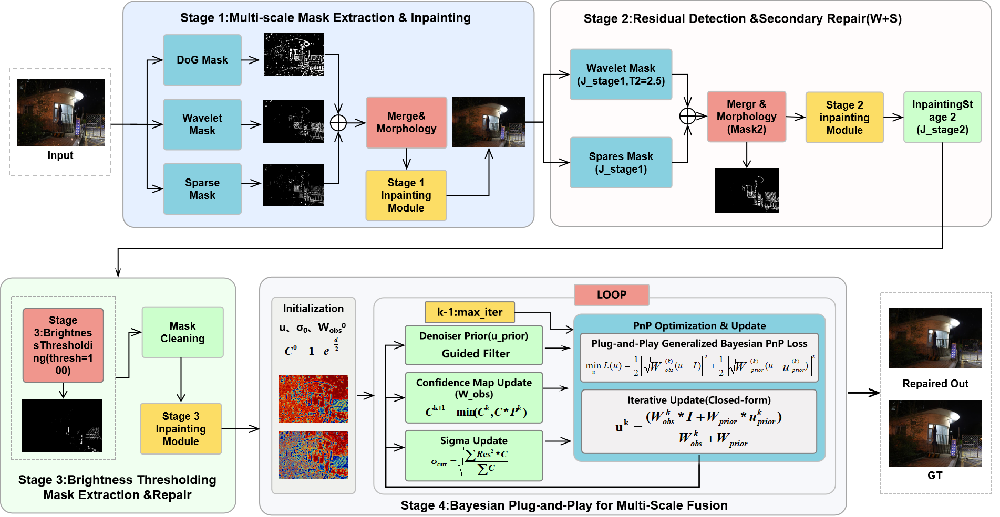

# Single-Image-Desnow-Based-on-Multi-domain-Feature-Prior-and-Bayesian-Plug-and-Play-Inference
This repository contains the code for the paper:
Single-Image-Desnow-Based-on-Multi-domain-Feature-Prior-and-Bayesian-Plug-and-Play-Inference
Lin Zhou, Zekun Chen, Lei Zhang, Shili Liang, Suqiu Wang, Bin Wang, Lu Qin

## 项目架构

The complete code will be published after the paper is accepted.
| 项目资源 | 链接 |
| :--- | :--- |
| **NSD(Paper)** | [IEEE Xplore](https://ieeexplore.ieee.org/document/10779380) |
| **AllWeatherNight (Pro)** | [GitHub](https://ieeexplore.ieee.org/document/10779380) |
